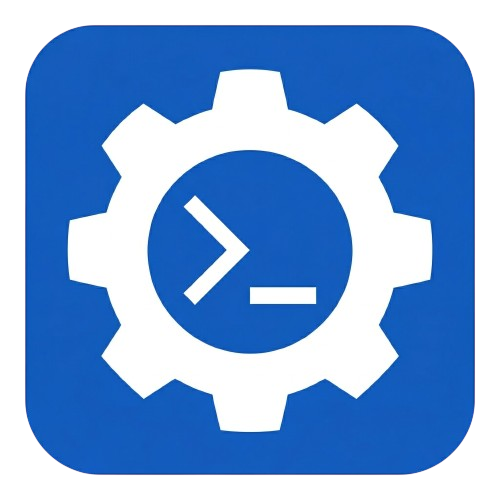

# 🧠 AI Prompt Engineer (UPE)

**AI Prompt Engineer** is a professional, high-performance web application built with **Next.js 16** and the **Vercel AI SDK**. It empowers users to craft, refine, and optimize complex AI prompts through a guided, interactive chat experience, ultimately generating a high-quality "Master Prompt" ready for use with LLMs like GPT-5 or Claude.

**🌐 Live Demo:** [promt-engineer.vokh.dev](https://promt-engineer.vokh.dev)



---

## ✨ Key Features

- **🤖 AI-Guided Engineering:** An interactive chat assistant that helps clarify requirements and expand on initial ideas.
- **🎨 Modern Split-Pane UI:** A sleek, dark-themed workspace with a real-time resizable split:
  - **Left Pane:** Chat interface for conversation and refinement.
  - **Right Pane:** "Master Prompt Canvas" where the final optimized prompt is displayed.
- **📊 Credit-Based System:** Built-in usage tracking with 3 initial credits provided upon user registration.
- **🔐 Secure Authentication:** Seamless Google OAuth integration via **NextAuth.js (v5)**.
- **⚡ Real-Time Streaming:** Leveraging Vercel AI SDK for ultra-fast, streaming AI responses.
- **📋 Copy-to-Clipboard:** One-click copying of the final engineered prompt.
- **📱 Responsive & Resizable:** Fully responsive design with an interactive divider to adjust your workspace.

---

## 🛠️ Tech Stack

### Core
- **Framework:** [Next.js 16](https://nextjs.org/) (App Router)
- **Language:** [TypeScript](https://www.typescriptlang.org/)
- **AI SDK:** [Vercel AI SDK](https://sdk.vercel.ai/)
- **API:** OpenAI (via `@ai-sdk/openai`)

### Backend & Auth
- **Database:** [Supabase](https://supabase.com/) (PostgreSQL & SSR Client)
- **Authentication:** [NextAuth.js v5](https://next-auth.js.org/) (Google Provider)

### UI & Styling
- **Styling:** [Tailwind CSS v4](https://tailwindcss.com/)
- **Icons:** Custom SVG components

---

## 🚀 Getting Started

### 1. Clone the repository
```bash
git clone https://github.com/tabaak/promt-engineer.git
cd promt-engineer/upe
```

### 2. Install dependencies
```bash
npm install
```

### 3. Environment Setup
Create a `.env.local` file in the `upe/` directory and add the following:

```env
# AI
OPENAI_API_KEY=your_openai_api_key

# NextAuth
AUTH_SECRET=your_auth_secret
NEXTAUTH_URL=http://localhost:3000

# Google OAuth
GOOGLE_CLIENT_ID=your_google_client_id
GOOGLE_CLIENT_SECRET=your_google_client_secret

# Supabase
NEXT_PUBLIC_SUPABASE_URL=your_supabase_url
SUPABASE_SERVICE_ROLE_KEY=your_supabase_service_role_key
```

### 4. Database Setup (Supabase)
Ensure your Supabase project has a `users` table with the following structure:
- `id`: uuid (primary key)
- `email`: text (unique)
- `credits`: integer (default: 3)
- `created_at`: timestamptz

You also need a PostgreSQL function to handle credit deduction:
```sql
CREATE OR REPLACE FUNCTION decrement_credits(user_email TEXT)
RETURNS VOID AS $$
BEGIN
  UPDATE users
  SET credits = credits - 1
  WHERE email = user_email AND credits > 0;
END;
$$ LANGUAGE plpgsql;
```

### 5. Run the development server
```bash
npm run dev
```
Open [http://localhost:3000](http://localhost:3000) with your browser to see the result.

---

## 📂 Project Structure

- `app/`: Next.js App Router components and API routes.
- `lib/`: Utility functions and database logic (Supabase client, credit management).
- `public/`: Static assets.
- `auth.ts`: NextAuth configuration.
- `middleware.ts`: Security and route protection.

*(All project files are located within the `upe/` directory)*


